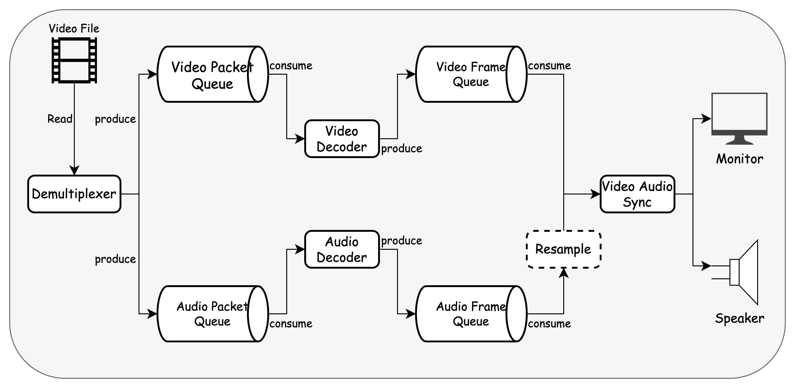

# media_player

A simple media player with pause, volume adjustment, playback speed adjustment
## Dependencies

| Library                           | Version |
|-----------------------------------|---------|
| [FFmpeg](https://ffmpeg.org/)     | 6.0.0+  |
| [SDL2](https://www.libsdl.org/)   | 2.0.0+  |
| [spdlog](https://github.com/gabime/spdlog) | 1.12.0+ |

## Build
```shell
mkdir cmake-build
cd cmake-build
cmake .. 
cmake --build .
```
## Run
```shell
cd cmake-build
# replace video_filepath with yours
./media_player ${video_filepath}
```

## Usage
| Keycode | Role                             |
|---------|----------------------------------|
| q       | exit                             |
| space   | pause/resume                     |
| m       | mute/unmute                      |
| ↑ / ↓   | increase/decrease volume         |
| ← / →   | increase/decrease playback speed |

## Progress Map
